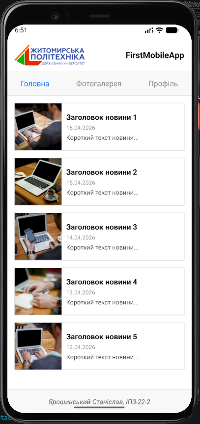
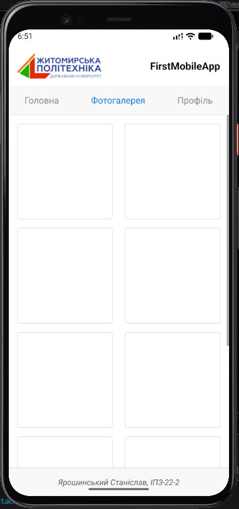
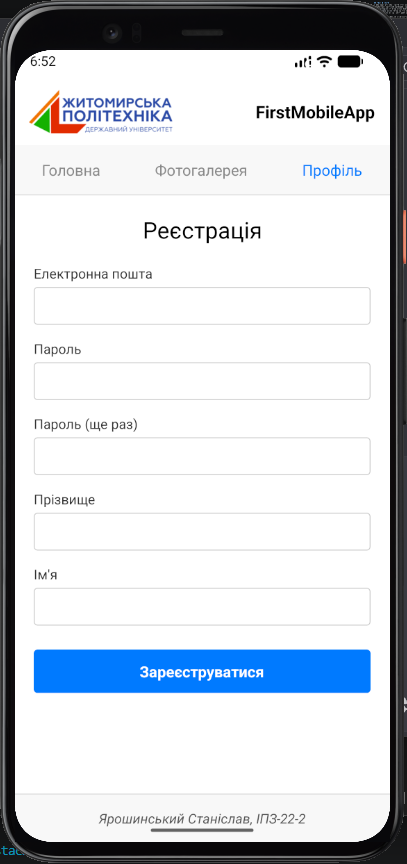

# Лабораторна робота №1: Основи React Native та Expo

**Виконав:** Ярошинський Станіслав, студент групи ІПЗ-22-2  
**Дисципліна:** Розробка мобільних додатків

## Опис проєкту
У цій лабораторній роботі створено базовий мобільний застосунок з використанням фреймворку Expo та бібліотеки React Navigation. 
Реалізовано кастомну навігацію (без анімації переходів для імітації вкладок) та три основні екрани:
- **Головна:** стрічка новин університету з використанням компонента `FlatList`.
- **Фотогалерея:** сітка карток 2х5, реалізована за допомогою `FlatList` та `numColumns`.
- **Профіль:** форма реєстрації з текстовими полями (`TextInput`) та кнопкою всередині `ScrollView`.

Також створено спільні компоненти `Header` (з логотипом університету) та `Footer`.

## Скріншоти застосунку

Декілька знімків екрана, що демонструють роботу додатку:

| Головна | Фотогалерея | Профіль |
| :---: | :---: | :---: |
|  |  |  |

## Інструкція із запуску

1. Переконайтеся, що у вас встановлено Node.js.
2. Клонуйте репозиторій та перейдіть у папку проекту:
   ```bash
   git clone https://github.com/Yaroshynskyi/MobileLabsRN2026.git
   cd lab1
3. Встановіть необхідні залежності:
    ```bash
    npm install
4. Запустіть сервер Expo:
    ```bash
    npx expo start

## Опис основних способів запуску мобільного додатка
Під час розробки застосунок тестувався двома основними способами:
1. На реальному фізичному пристрої (через Expo Go)
    * Призначення: Тестування реального користувацького досвіду, плавності інтерфейсу та взаємодії через сенсорний екран.

    * Особливості запуску: Потребує встановлення додатка "Expo Go" на смартфон. Запуск відбувається шляхом сканування QR-коду з термінала (пристрої мають бути в одній Wi-Fi мережі, або використовується прапорець --tunnel).

    * Відмінності: Максимально наближено до реальних умов експлуатації. Дозволяє легко тестувати апаратні функції (камеру, геолокацію).

2. На емуляторі Android (віртуальний пристрій Pixel 4)
    * Призначення: Швидка розробка, написання коду та дебагінг без необхідності постійно відволікатися на фізичний телефон.

    * Особливості запуску: Потребує встановленого Android Studio та налаштованого Virtual Device (AVD). Після запуску віртуального пристрою, в терміналі Expo достатньо натиснути клавішу a, щоб застосунок розгорнувся на емуляторі.

    * Відмінності: Дуже зручно для верстки, оскільки екран знаходиться поруч з редактором коду. Дозволяє симулювати різні умови (наприклад, іншу геолокацію або низький заряд батареї), але споживає багато ресурсів комп'ютера.