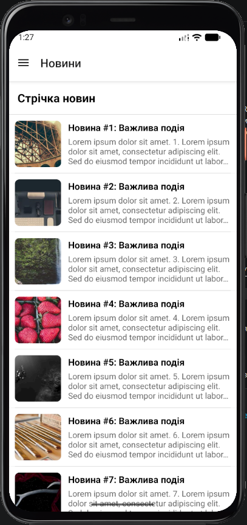
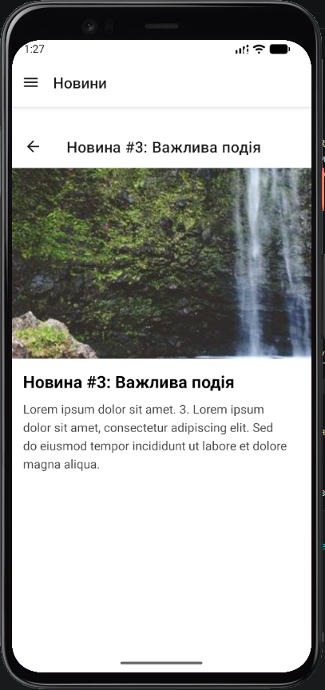
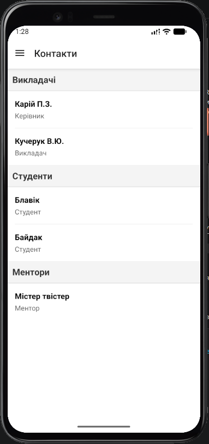

# Лабораторна робота №2: Вкладена навігація та оптимізація списків

**Виконав:** Ярошинський Станіслав, студент групи ІПЗ-22-2  
**Дисципліна:** Розробка мобільних додатків

## Інструкція sp запуску
1. Перейдіть до директорії лабораторної роботи:
   ```bash
   cd lab2
2. Встановіть необхідні залежності:
    ```bash
    npm install
3. Запустіть проект за допомогою Expo:
    ```bash
    npx expo start

## Опис реалізованого функціоналу
- Стрічка новин (FlatList): Реалізовано відображення 50 об'єктів із механізмом віртуалізації для економії пам'яті. Додано Pull-to-Refresh для оновлення списку та Infinite Scroll для динамічного підвантаження даних. Використано кастомні Header, Footer та розділювач елементів.
- Вкладена навігація: Використано Drawer Navigator як кореневий контейнер, у який вкладено Stack Navigator для переходів між списком новин та екраном деталей. Це дозволило усунути ефект подвійного хедера.
- Екран деталей: Реалізовано передачу об'єкта новини через параметри навігації та встановлення динамічного заголовка екрана.
- Екран контактів (SectionList): Створено групований список (викладачі, студенти, ментори) із використанням заголовків секцій та розділювачів.
- Кастомізація Drawer: Створено власний компонент меню, що відображає аватар, ПІБ та назву групи студента.

## Скріншоти застосунку
екілька знімків екрана, що демонструють роботу додатку:

| Головна сторінка (FlatList) | Екран деталей новини | Екран контактів (SectionList) | Кастомне Drawer меню |
| :---: | :---: | :---: | :---: |
|  |  |  |  |


## Висновки (Відповіді на контрольні запитання)
- **Чим відрізняється FlatList від ScrollView?** ScrollView рендерить усі свої дочірні елементи одночасно, що призводить до падіння продуктивності при великих списках. FlatList рендерить лише ті елементи, які видимі на екрані в даний момент.
- **Що таке віртуалізація списків?** Це механізм, при якому невидимі елементи видаляються з дерева рендерингу, а компоненти перевикористовуються під час прокрутки для економії ресурсів RAM та CPU.
- **Як здійснюється передача параметрів між екранами?** Дані передаються як другий аргумент у функціях Maps() або push(). На цільовому екрані вони доступні через об'єкт route.params.
- **Що таке вкладена навігація?** Це архітектура, при якій один навігатор (наприклад, Stack) рендериться всередині екрана іншого навігатора (наприклад, Drawer або Tabs).
- **У яких випадках застосовується SectionList?** Він використовується для відображення однорідних даних, які мають бути згруповані за логічними категоріями з окремими заголовками для кожної групи.