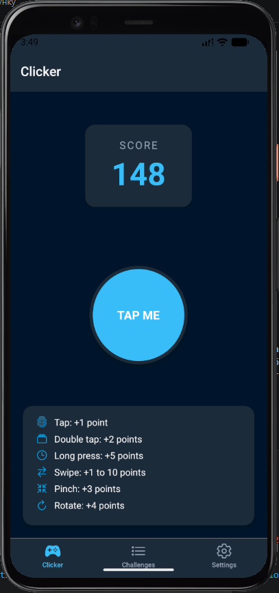
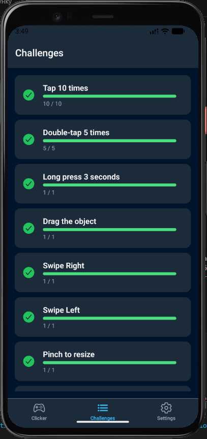
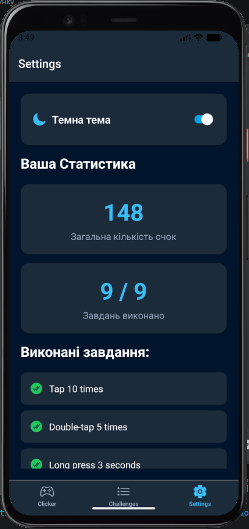

# Лабораторна робота №3: Gesture Clicker

**Виконав:** Ярошинський Станіслав, студент групи ІПЗ-22-2  
**Дисципліна:** Розробка мобільних додатків

## Інструкція із запуску

1. Переконайтеся, що у вас встановлено Node.js.
2. Клонуйте репозиторій та перейдіть у папку проекту:
   ```bash
   git clone https://github.com/Yaroshynskyi/MobileLabsRN2026.git
   cd lab3
3. Встановіть необхідні залежності:
    ```bash
    npm install
4. Запустіть сервер Expo:
    ```bash
    npx expo start
5. Відсканувати QR-код через додаток Expo Go (Android) або камеру (iOS).

## Опис реалізованого функціоналу
Додаток являє собою гру-клікер, де взаємодія з об'єктом відбувається через кастомні жести.

### Реалізовані жести та нарахування очок:
* **Single Tap:** +1 бал (анімоване стискання кнопки).
* **Double Tap:** +2 бали.
* **Long Press:** +5 балів (із візуальним оповіщенням).
* **Swipe вліво/вправо:** випадкова кількість очок (1-10).
* **Pinch (масштабування):** +3 бали (об'єкт змінює розмір і пружинить назад).
* **Rotation (обертання):** +4 бали (власне завдання: об'єкт обертається слідом за пальцями).
* **Pan (перетягування):** вільне переміщення об'єкта по екрану з поверненням у центр.

### Технічні особливості:
* **Навігація:** Використано `Bottom Tab Navigator` для переходу між грою, списком завдань та статистикою.
* **Стилізація:** Реалізована через `Styled Components`.
* **Теми:** Підтримка світлої та темної тем через глобальний `ThemeContext`.
* **Стан:** Глобальне управління балами та прогресом через `GameContext`.

## Скріншоти роботи застосунку
| Головний екран | Челенджі | Налаштування та Статистика |
| :--- | :--- | :--- |
|  |  |  |

## Висновки
У ході виконання роботи було опановано бібліотеку `react-native-gesture-handler` для реалізації складних користувацьких взаємодій. Навчився вирішувати конфлікти жестів (наприклад, між Pan та Pinch) за допомогою `simultaneousHandlers` та розв'язувати проблеми кільцевих залежностей (Require cycles) у структурі React-компонентів. Використання `Styled Components` дозволило створити гнучку систему тем, що адаптується до вподобань користувача.