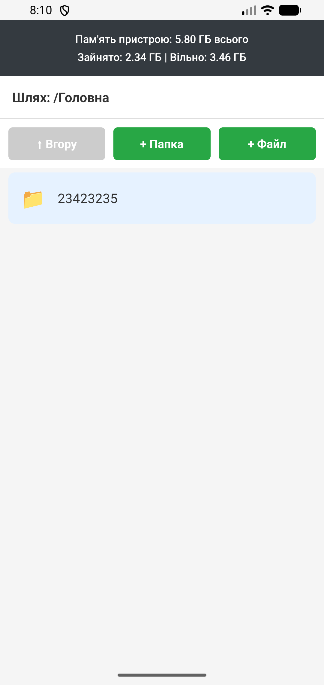
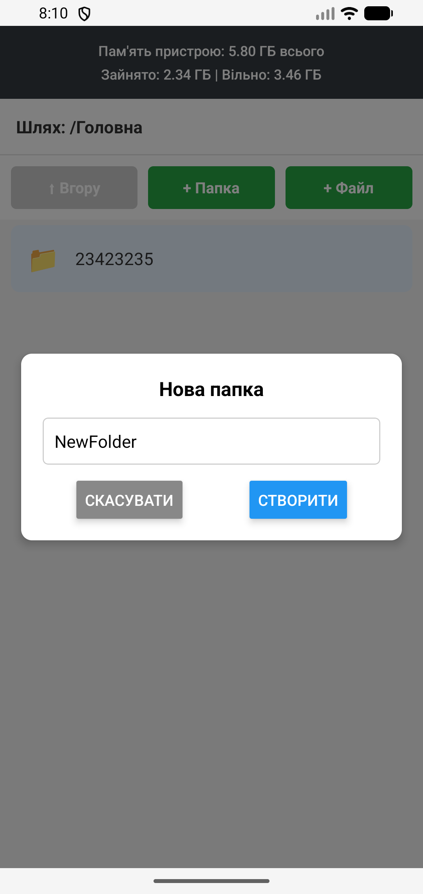
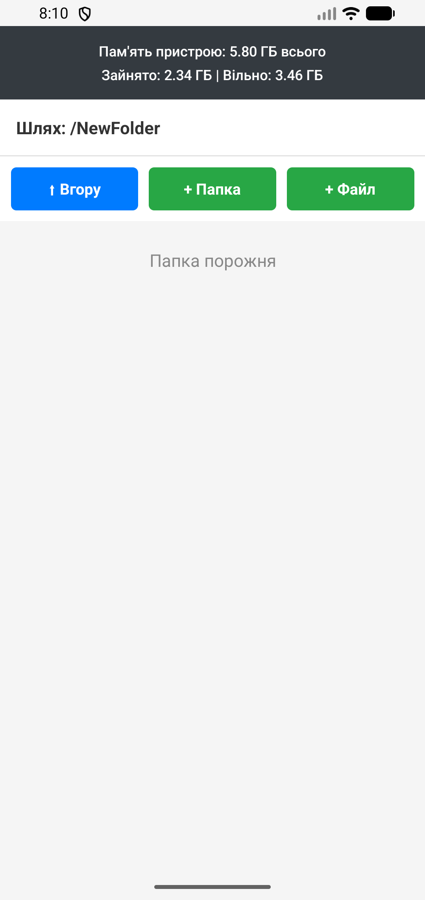
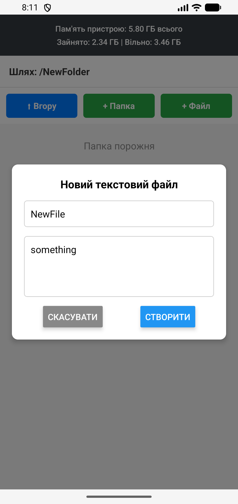
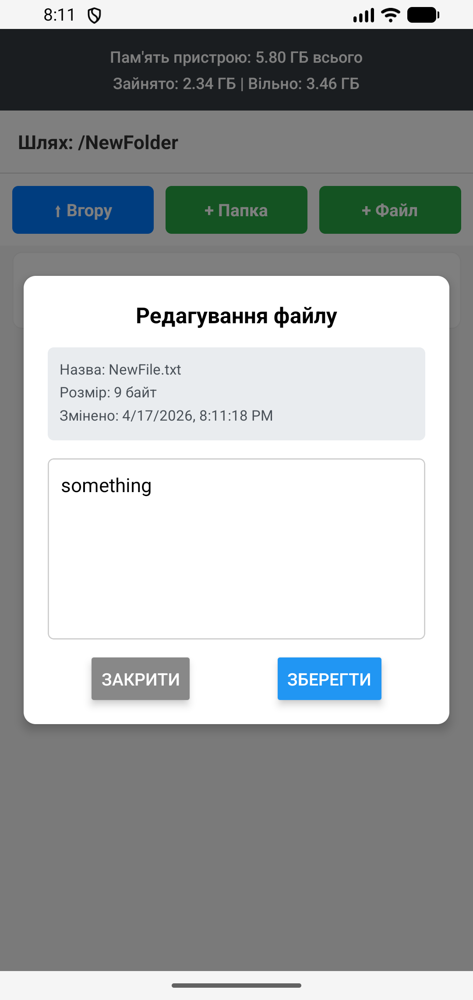
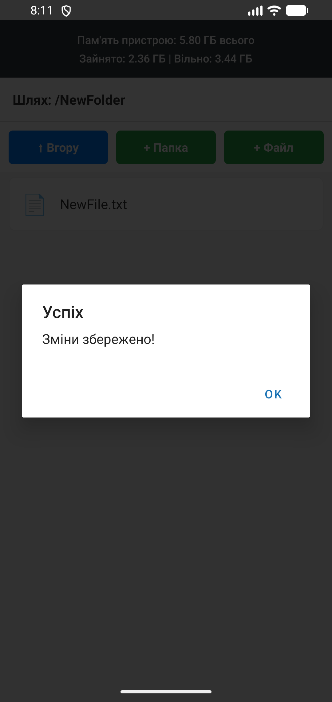
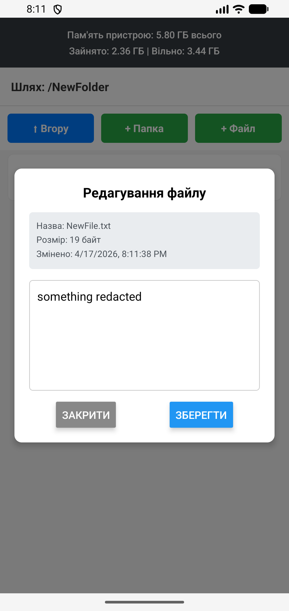
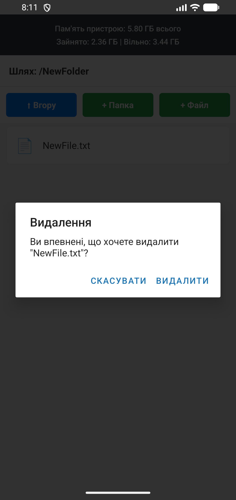

# Лабораторна робота №4: Файловий менеджер 

**Виконав:** Ярошинський Станіслав, студент групи ІПЗ-22-2  
**Дисципліна:** Розробка мобільних додатків

## Інструкція із запуску

1. Переконайтеся, що у вас встановлено Node.js.
2. Клонуйте репозиторій та перейдіть у папку проекту:
   ```bash
   git clone https://github.com/Yaroshynskyi/MobileLabsRN2026.git
   cd lab4
3. Встановіть необхідні залежності:
    ```bash
    npm install
4. Запустіть сервер Expo:
    ```bash
    npx expo start
5. Відсканувати QR-код через додаток Expo Go (Android) або камеру (iOS).

## Опис проєкту

У рамках лабораторної роботи розроблено мобільний застосунок для безпечної роботи з локальною файловою системою пристрою з використанням бібліотеки `expo-file-system`. Додаток працює в ізольованому середовищі `Paths.document` для забезпечення персистентного зберігання даних.

**Основні можливості:**
1. **Навігація:** Відображення списку файлів та папок, індикація поточного шляху, можливість переходу у вкладені папки та повернення "Вгору".
2. **Створення:** Додавання нових директорій та текстових файлів (`.txt`) із початковим вмістом через модальні вікна.
3. **Читання та Редагування:** Відкриття `.txt` файлів, перегляд їхнього тексту, внесення змін та збереження на диск.
4. **Видалення:** Безпечне видалення файлів та папок (через довге натискання — Long Press) із попереднім підтвердженням.
5. **перегляд інформації файлів:** Перегляд детальної інформації про обраний файл (назва, розмір у байтах, дата останньої модифікації).
6. **Статистика пам'яті пристрою:** Відображення глобальної статистики накопичувача пристрою (загальний, зайнятий та вільний простір у ГБ).

## Скріншоти роботи застосунку
| Головний екран | Створення папки | У середині створеної папки | Створення файлу | У середині створеного файлу | Повідомлення про успішне редагування файлу | У середині відредагованого файлу | Видалення файлу |
| :--- | :--- | :--- | :--- | :--- | :--- | :--- | :--- |
|  |  |  |  |  |  |  |  |


