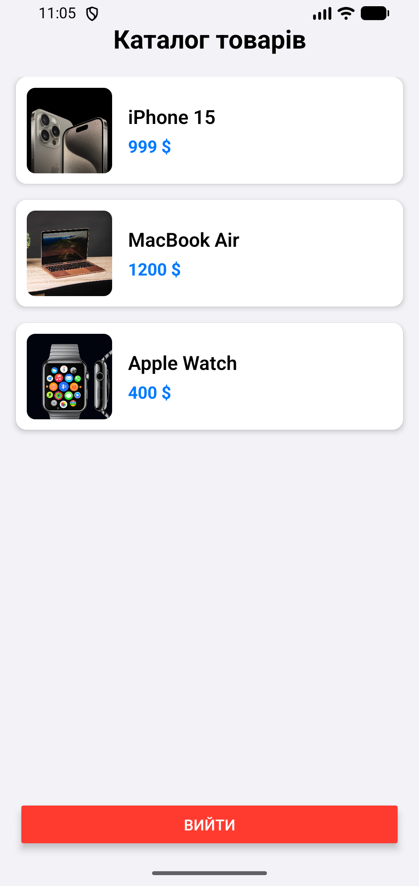
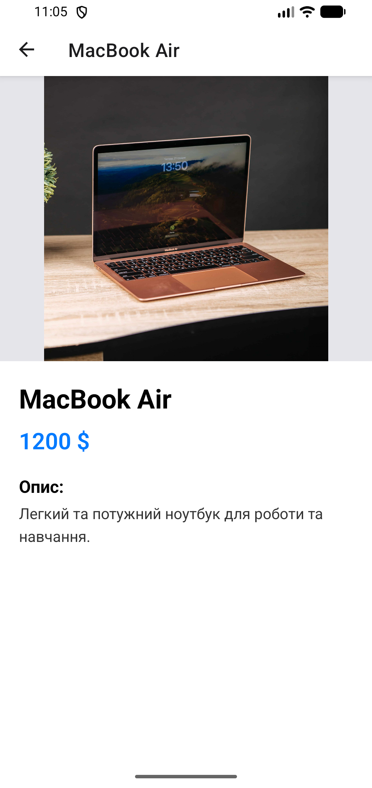
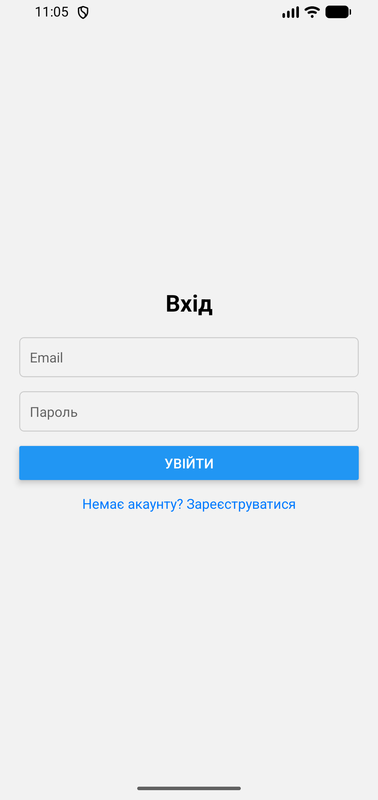
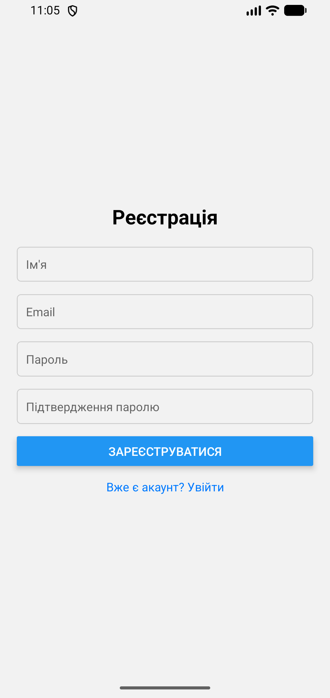
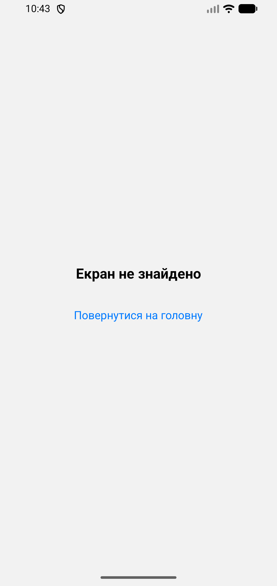

# Лабораторна робота №5: навігація із Expo Router

**Виконав:** Ярошинський Станіслав, студент групи ІПЗ-22-2  
**Дисципліна:** Розробка мобільних додатків

## Інструкція із запуску

1. Переконайтеся, що у вас встановлено Node.js.
2. Клонуйте репозиторій та перейдіть у папку проекту:
   ```bash
   git clone https://github.com/Yaroshynskyi/MobileLabsRN2026.git
   cd lab5
3. Встановіть необхідні залежності:
    ```bash
    npm install
4. Запустіть сервер Expo:
    ```bash
    npx expo start
5. Відсканувати QR-код через додаток Expo Go (Android) або камеру (iOS).

## Опис проєкту

У рамках лабораторної роботи було створено мобільний застосунок з використанням file-based маршрутизації `Expo Router`. Реалізовано наступний функціонал:
* **Глобальний стан:** Створено AuthContext для керування станом авторизації користувача (логін, реєстрація, вихід).
* **Публічні маршрути:** Реалізовано екрани входу `login.jsx` та реєстрації `register.jsx` у групі маршрутів `(auth)`.
* **Захищені маршрути:** Створено групу `(app)`, яка за допомогою компонента <Redirect> блокує доступ неавторизованим користувачам та перенаправляє їх на сторінку входу.
* **Каталог товарів:** Головна сторінка відображає список товарів (тестові дані) за допомогою `FlatList`.
* **Динамічна навігація:** При натисканні на товар здійснюється перехід на екран деталей `(details/[id].jsx)`, куди передається унікальний ідентифікатор товару для відображення детальної інформації.
* **Обробка помилок:** Реалізовано екран `+not-found.jsx` для перехоплення неіснуючих маршрутів.

## Скріншоти роботи застосунку
| Екран каталогу | Екран товару | Екран логіну | Екран реєстрації | Екран 404 |
| :--- | :--- | :--- | :--- | :--- |
|  |  |  |  |  |

## Висновки (Відповіді на контрольні запитання)

- **Яким чином за допомогою Ехро Router реалізується перенаправлення неавторизованого користувача?** Перенаправлення реалізується декларативним шляхом за допомогою компонента <Redirect href="..." />. У файлі макета (_layout.jsx) захищеної групи маршрутів виконується перевірка стану авторизації. Якщо користувач не авторизований (isAuthenticated === false), макет повертає компонент <Redirect>, який автоматично змінює маршрут на сторінку логіну.
- **У чому полягає різниця між використанням компонента <Link> та метода router.push()?** Компонент <Link> використовується для декларативної навігації (аналогічно тегу <a> у вебі). Він ідеально підходить для звичайних переходів, кнопок меню та списків, автоматично підтримує Accessibility та є оптимізованим для нативних переходів .
Метод router.push() з хука useRouter забезпечує імперативну (програмну) навігацію. Він застосовується тоді, коли перехід має відбутися не за прямим кліком користувача по посиланню, а внаслідок певної логічної події (наприклад, після успішного запиту до API, таймера або складної валідації форми).
- **Як працюють динамічні маршрути в Еxpo Router і як отримати передані параметри?** Динамічні маршрути створюються шляхом використання квадратних дужок у назві файлу (наприклад, [id].jsx) . Цей файл перехоплює будь-яке значення сегмента URL-адреси на цій глибині. Щоб отримати переданий параметр всередині компонента, використовується хук useLocalSearchParams, який повертає об'єкт із ключами, що відповідають назвам у дужках (наприклад, const { id } = useLocalSearchParams();) .
- **Чому стан авторизації доцільно зберігати у глобальному контексті (React Context), а не в локальному стані компонента?** Стан авторизації є даними, які необхідні багатьом незалежним компонентам на різних рівнях дерева навігації (наприклад, перевірка доступу в _layout.jsx, логіка входу в login.jsx, кнопка виходу в index.jsx) . Якби стан зберігався локально, його довелося б передавати через "prop drilling", що вкрай складно реалізувати між незалежними екранами навігатора. Глобальний контекст надає єдине джерело істини, доступне будь-якому екрану застосунку.
- **Для чого використовуються групи маршрутів (folderName) і як вони впливають на URL-адресу?** Групи маршрутів створюються за допомогою папок, назви яких взяті в круглі дужки (наприклад, (auth)). Вони дозволяють логічно згрупувати екрани та застосувати до них спільний макет (_layout.jsx) без зміни самої URL-адреси. Назва папки в дужках ігнорується маршрутизатором, тому екран app/(auth)/login.jsx буде доступний за коротким шляхом /login.