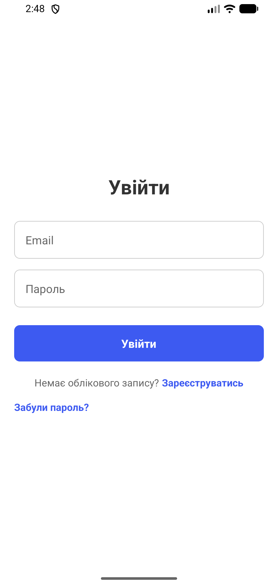
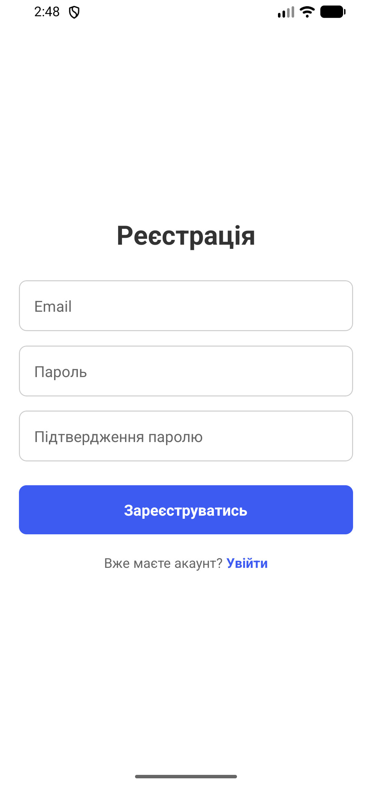
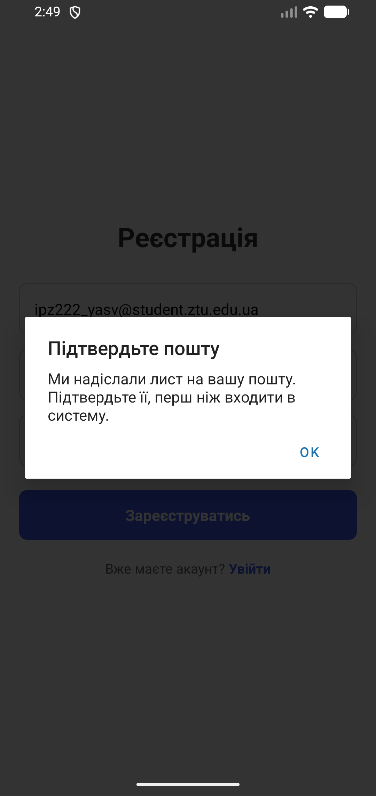
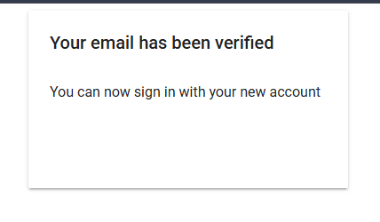
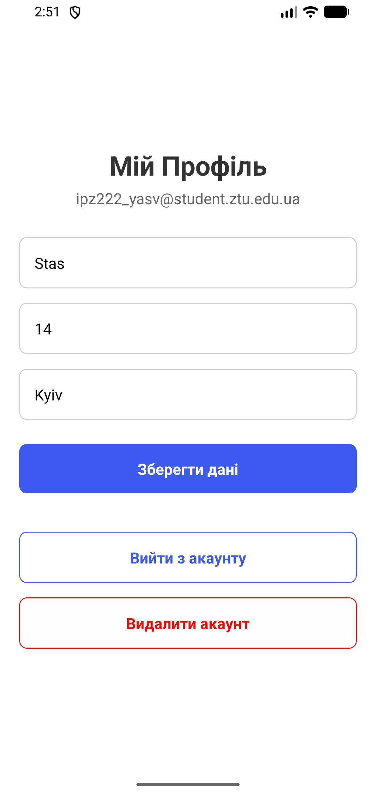
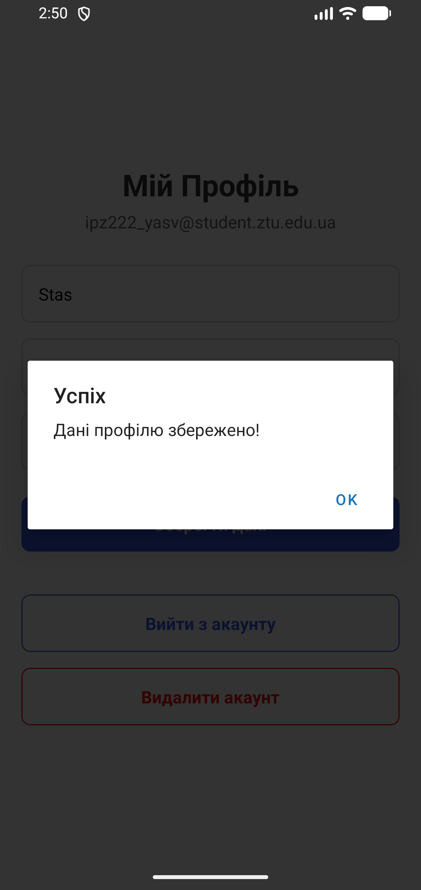
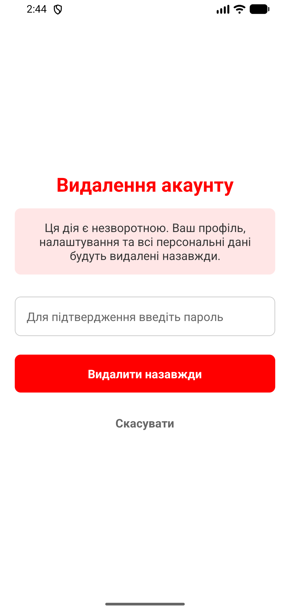
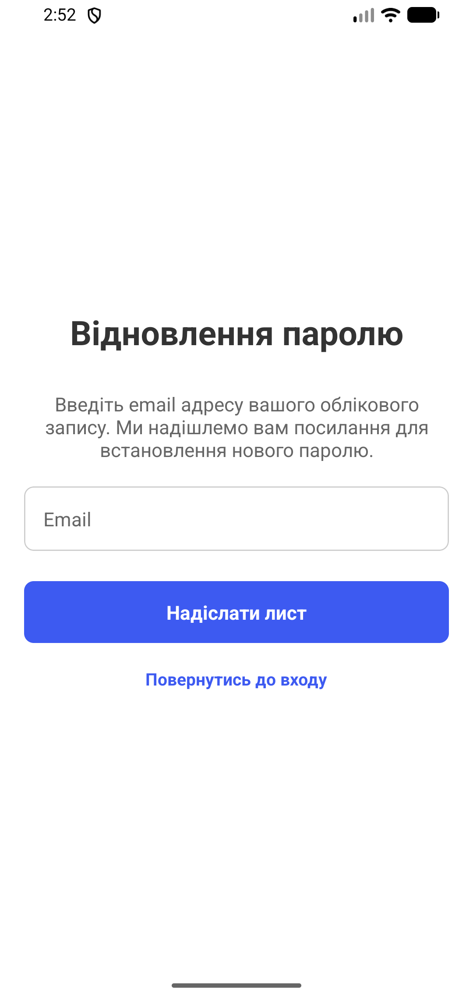
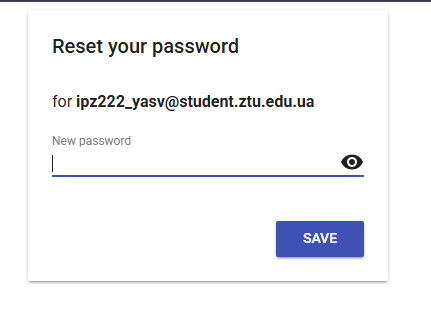

# Лабораторна робота №6: Dвторизації та збереження персональних даних (Firebase, Firestore)

**Виконав:** Ярошинський Станіслав, студент групи ІПЗ-22-2  
**Дисципліна:** Розробка мобільних додатків

## Інструкція із запуску

1. Переконайтеся, що у вас встановлено Node.js.
2. Клонуйте репозиторій та перейдіть у папку проекту:
   ```bash
   git clone https://github.com/Yaroshynskyi/MobileLabsRN2026.git
   cd lab6
3. Встановіть необхідні залежності:
    ```bash
    npm install
4. Запустіть сервер Expo:
    ```bash
    npx expo start
5. Відсканувати QR-код через додаток Expo Go (Android) або камеру (iOS).

## Опис реалізованого функціоналу

- **Авторизація:** Реалізовано вхід, реєстрацію (з підтвердженням email) та скидання пароля через Firebase Auth.
- **Збереження даних:** Авторизований користувач може зберігати та редагувати свій профіль (ім'я, вік, місто) у Firestore.
- **Безпека:** Доступ до екранів захищено через Expo Router (групи `auth` та `app`). База даних захищена Firestore Security Rules (доступ лише до власного документа).
- **Видалення акаунту:** Реалізовано можливість повного видалення профілю з бази даних та облікового запису з повторною автентифікацією.

## Скріншоти роботи застосунку

| Логін | Реєстрація | Підтвердження реєстрації | Повідомлення після під. пошти | Профіль |
| :--- | :--- | :--- | :--- | :--- |
|  |  |  |  |  |
| Повідомлення про зміни профіля | Видалення | Відновлення паролю | Форма зміни паролю | |
|  |  |  |  | |

## Висновки

Під час виконання лабораторної роботи було набуто практичних навичок інтеграції Firebase у мобільний застосунок на React Native. Було налаштовано систему авторизації, маршрутизацію для публічних та захищених екранів, а також реалізовано CRUD-операції з хмарною базою даних Firestore із забезпеченням правил безпеки.
